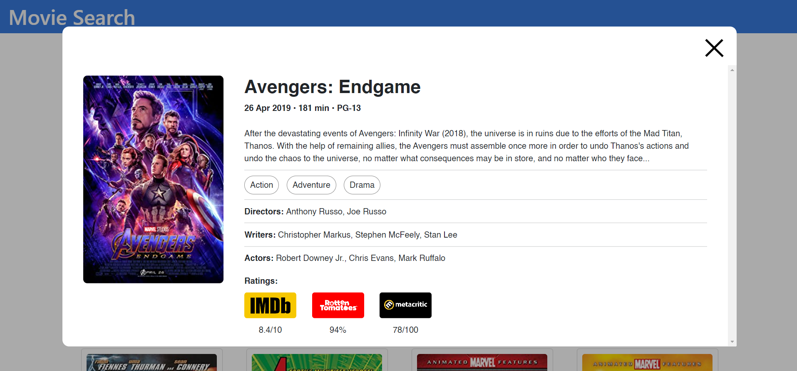

# movie-search-app

a simple, responsive and functional movie searching app made using ReactJS.

hosted link: [https://movie-search-yb.netlify.app/](https://movie-search-yb.netlify.app/)

I have made this movie search app to practice my React skills. Mainly I make web pages by only keeping in mind of large screen users(PC, TV, laptops) and forgetting about small screen users(Mobile, Tablets).

In this app i tried my best to make it responsive for all types of devices. This helped me polish my responsive CSS skills.

This app uses [omdb API](https://www.omdbapi.com/) for fetching the movie data as well as [Bootstrap](https://getbootstrap.com/) for responsive containers and styling

---

## Screenshots


<div align="center">
  
  
</div>

---

## To run the project

open a terminal window

```
git clone https://github.com/yasinbhojani/movie-search
```

```
cd movie-search
```

download dependencies
```
npm install
```

run the project
```
npm start
```